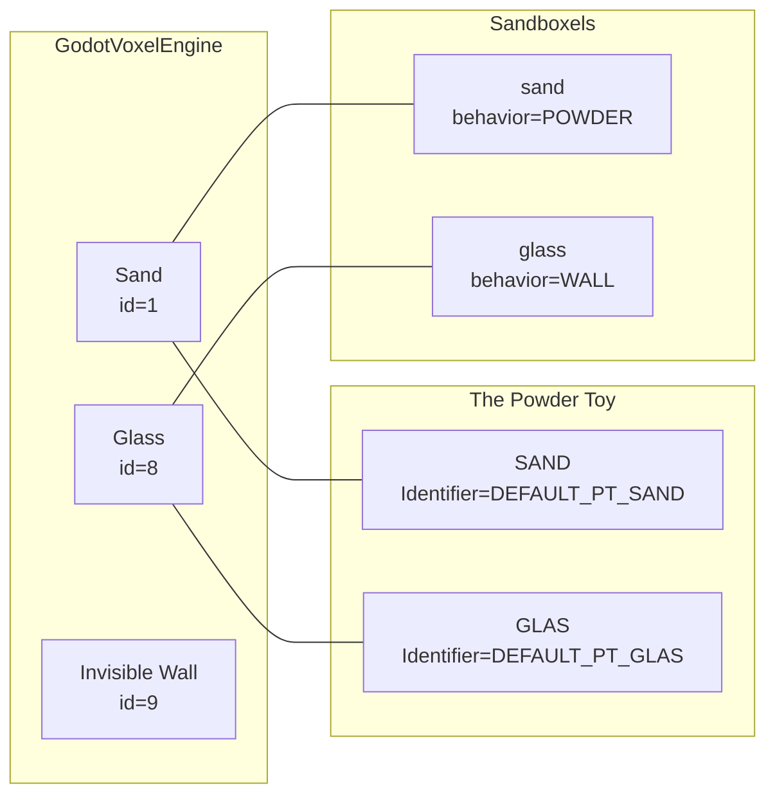

# Material Mapping (Initial)

## Source Pointers

- GodotVoxelEngine
- Sand/glass/invisible IDs and behavior are defined in shaders and scene scripts.

- The Powder Toy
- Sand: `references/The-Powder-Toy/src/simulation/elements/SAND.cpp`
- Glass: `references/The-Powder-Toy/src/simulation/elements/GLAS.cpp`

- Sandboxels
- Sand: `references/sandboxels/index.html`
- Glass: `references/sandboxels/index.html`
